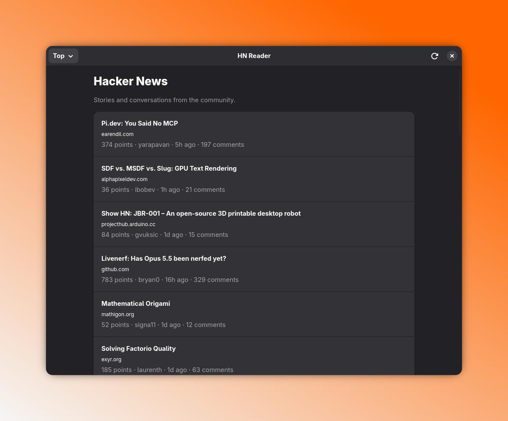

# HN Reader

A native GNOME reader for Hacker News, written in Crystal with GTK4 and libadwaita.
Read Top, New, Best, Ask, Show and Jobs feeds, follow comment threads, and view
articles in an embedded WebKitGTK browser.



## Build and run

Requires Crystal **1.21 or later**, Shards, GTK **4.12 or later**, libadwaita
**1.5 or later**, WebKitGTK **6.0 API**, libsoup **3.0 API**, libxml2 and
GObject Introspection's **1.0** development library. The `6.0` in WebKit's
package name identifies its GTK4 API, not the engine release.

On Fedora 43:

```sh
sudo dnf install crystal shards make gcc pkgconf-pkg-config \
  gtk4-devel libadwaita-devel webkitgtk6.0-devel \
  gobject-introspection-devel libsoup3-devel libxml2-devel
make setup
make run
```

`make setup` installs the locked Crystal dependencies and generates bindings
from the installed GObject typelibs. Run it again after changing the dependency
versions or upgrading the system libraries. Generated bindings and binaries
are not committed. `make build` produces `bin/hnreader` and its SHA-256 checksum
in `bin/hnreader.sha256`. It also reads the version from `shard.yml` and creates
a release directory and a ready-to-upload archive:

```text
dist/hnreader-<version>-<platform>-x86_64/
dist/hnreader-<version>-<platform>-x86_64.tar.gz
dist/hnreader-<version>-<platform>-x86_64.tar.gz.sha256
```

The archive contains the binary in `bin/`, the desktop entry and icon under
`share/`, plus `LICENSE` and `README.md`. Upload the `.tar.gz` and its
`.tar.gz.sha256` file to GitHub Releases. After downloading both into the same
directory, verify the **archive** with (example for version `0.1.0`):

```sh
sha256sum --check hnreader-0.1.0-fedora43-x86_64.tar.gz.sha256
```

Separate **x86_64** binary releases are built for **Fedora 43**, **Debian 13** and
**Ubuntu 24.04 LTS**. `<platform>` is `fedora43`, `debian13` or `ubuntu24.04`,
automatically detected from the build system. Choose the archive matching your
OS. Packaging rejects unsupported systems rather than giving a binary the wrong label.

Each release requires its distribution's **GTK4, libadwaita, WebKitGTK and libsoup
runtime dependencies**. Binaries remain dynamically linked; archives do not bundle
system `.so` libraries or statically link GTK/WebKit. Each binary is built inside
its target distribution; packaging does not cross-compile.

On Debian 13 or Ubuntu 24.04, install Crystal 1.21 or newer and Shards, then install
the native build dependencies before `make setup`:

```sh
sudo apt-get update
sudo apt-get install build-essential pkg-config libglib2.0-dev libgc-dev \
  libevent-dev libssl-dev libpcre2-dev libgmp-dev libyaml-dev libxml2-dev \
  libgtk-4-dev libadwaita-1-dev libwebkitgtk-6.0-dev \
  libgirepository1.0-dev libsoup-3.0-dev
make setup
make build
```

`make clean` removes the generated release artifacts in `dist/`. Each
`make build` recreates the current version's release directory and archive.

If the GTK, libadwaita, WebKit and GObject Introspection runtime libraries and
typelibs are already installed, Make can also use them without their `-devel`
linker symlinks. It discovers the libraries using the C compiler and creates
local linker names in `.build/lib`. No system files are changed, and no temporary
`/tmp` links or manual `LIBRARY_PATH` settings are needed. The binary still loads
the system libraries by their normal SONAMEs. The development packages above
remain the recommended way to provision a fresh build environment.

Optional user-local desktop installation:

```sh
make install
```

This installs the binary, desktop entry and icon under `~/.local`. Ensure
`~/.local/bin` is on your desktop session's `PATH`. No Flatpak package is included.
Installation also refreshes the icon cache. The application embeds its icon at
build time, so the About dialog displays it even when running an uninstalled binary.
Building requires `glib-compile-resources`; installing requires `gtk-update-icon-cache`.

To remove the installed binary, desktop entry and icon:

```sh
make uninstall
```

Uninstallation refreshes the icon cache and preserves user settings. If you
overrode `PREFIX` or `DESTDIR` during installation, use the same values when
uninstalling.

## Using the reader

- Open **Settings** in the header to choose System, Light, Sepia or Dark appearance.
  Changes apply immediately and are saved in `$XDG_CONFIG_HOME/hnreader/theme`
  (by default `~/.config/hnreader/theme`). External articles retain their website styling.
- In **Settings → Startup**, choose the default feed (Top, New, Best, Ask, Show or Jobs).
  It opens on the next launch; Top is used until you choose another feed.
- Open **About HN Reader** in the header for the app description, version, license,
  and links to GitHub and Hacker News.

- Select a feed in the header. Feeds, stories and comments are cached for five
  minutes, including across app restarts. **Refresh** clears the cache and reloads
  the feed; **Load More** fetches the next 30 entries in Hacker News order.
- Open a story to switch to its own screen. **Article** displays the original
  website; **Discussion** displays the post text and native comment widgets.
  Posts without an external link open directly in Discussion.
- Expand a comment's replies to load them. Each level is paginated independently.
- The header's back button returns to the feed with its scroll position intact.
  The article toolbar's arrows navigate website history instead.
- **Open in Browser** opens the current page externally. New windows and file
  downloads are handed to the system browser.
- Network failures have retry controls. The UI follows GNOME's light/dark theme;
  websites retain their own styles.

This version is a read-only, online reader. It does not include HN login,
voting, posting, search, bookmarks, translation or a full offline mode. API responses
are cached under `$XDG_CACHE_HOME/hnreader/api-v1` (by default
`~/.cache/hnreader/api-v1`). Expired entries are ignored and cleaned up on startup.
Cache storage failures do not prevent network loading. External article pages are
not stored in this cache. Website cookies use an ephemeral WebKit session and
are not persisted as a browser profile.

## Development

```sh
make format     # apply the standard Crystal formatter
make test       # deterministic core tests; no display or Internet required
make check      # formatting and core tests
make build      # also validates generated GTK/Soup/WebKit interfaces
make smoke      # opt-in GUI/HTTP/WebKit integration test; needs a desktop and Python 3
```

The core tests require Crystal and libxml2 development files but not the GUI
bindings. `CRYSTAL_CACHE_DIR` defaults to `/tmp/hnreader-crystal-cache` in the
Makefile and can be overridden.

The GUI test starts a temporary localhost HTTP server, opens a separate test
window, exercises feeds, retry/pagination, comment expansion, WebKit history,
scroll restoration and a narrow dark layout, then exits. Screenshots go to
`/tmp/hnreader-smoke` (override with `HN_SMOKE_OUTPUT`). It uses fixture data and
does not contact Hacker News.

### GitHub Actions and releases

**CI** runs `make check` and `make build` on branch pushes, pull requests and
manual runs. The shared build workflow runs a matrix of **Fedora 43**, **Debian 13**
and **Ubuntu 24.04** x86_64 containers, with Crystal 1.21.1 and dependencies from
`shard.lock`. Download each archive and its checksum from the corresponding
`hnreader-<platform>-x86_64` artifact (kept for 14 days).
GUI smoke tests remain a separate desktop check via `make smoke`.

To prepare a release:

1. Update `version` in `shard.yml` and the displayed `VERSION` in
   `src/hnreader/constants.cr`, then commit the changes.
2. Create and push a matching tag, for example:

   ```sh
   git tag v0.2.0
   git push origin v0.2.0
   ```

3. The **Release** workflow checks that the tag matches `shard.yml`, runs the
   same checks/build on all three distributions, verifies every checksum and creates
   a **draft GitHub Release** with three `.tar.gz` archives and their `.sha256` files
   attached. Review its notes and publish it from GitHub Releases.

Rerunning the workflow updates assets only while the release is a draft;
published releases are not overwritten. Uploads use the built-in `GITHUB_TOKEN`
with `contents: write` only in the release job; no personal access token is needed.
The workflows become active after they are pushed to GitHub.

### Code organization

- `src/hnreader/hn/`: HN models, API client, ordered batches and feed state;
  this code depends on the HTTP interface, never on GTK or Soup.
- `src/hnreader/http/`: request cancellation, the transport interface and its
  asynchronous Soup implementation. The transport does not load GTK.
- `src/hnreader/ui/`: window navigation, separate feed/story views, comments,
  WebKit articles and presentation helpers. Markup and text formatting remain
  usable without GTK.
- `src/hnreader/application.cr`: application lifecycle and dependency assembly.
  The executable entry point only starts it. Shared identity/version constants
  live in `constants.cr`.
- `spec/`: mirrors the production modules. Fake transport and GUI inspection
  helpers live in `spec/support`; GUI helpers are loaded only by the smoke test.

### Code style

Use `make format` before committing; `make check` checks the standard Crystal
format and runs the unit tests. `.editorconfig` specifies UTF-8, LF, two-space
indentation for Crystal/shell and tabs for Make recipes.

Keep each class focused on one responsibility, with explicit dependencies and
small methods. Use predicate names ending in `?`, descriptive action names such
as `select_feed` and `load_more`, and explicit return types for public methods.
Catch expected errors at the network/JSON boundary; let programming errors
surface. Keep application classes free of test-only inspection methods.

The code uses Crystal's standard tools directly:

- `HN::Item` declares its JSON schema with `JSON::Serializable`, field defaults
  and `@[JSON::Field]`; malformed field types become parsing errors.
- Async callbacks receive one union-typed result. For an item this is
  `Item | Nil | Failure`: a value, an absent item, or a failure. Exhaustive
  `case … in` branches keep those states explicit; `Failure` is a `record`.
- The client's generic `fetch` preserves the decoder's result type. Pagination
  derives `has_more?` from the loaded IDs instead of storing a second flag.
- Widget configuration uses named arguments and `tap`; collections use
  `select`, `compact` and `uniq!`. The request queue is a `Deque`.

The official API is documented at <https://github.com/HackerNews/API>.
Bindings use <https://github.com/hugopl/libadwaita.cr> and
<https://github.com/hugopl/gi-crystal>. The project includes binding configurations
for Soup 3.0 and WebKit 6.0.

Before a release, check all feeds, text-only posts, long/deep comment threads,
article navigation, external links, failed requests, returning to a scrolled
feed, narrow windows and both GNOME color schemes. Confirm that slow networking
does not block resizing, scrolling or navigation.

Licensed under GPL-3.0; see [LICENSE](LICENSE).
